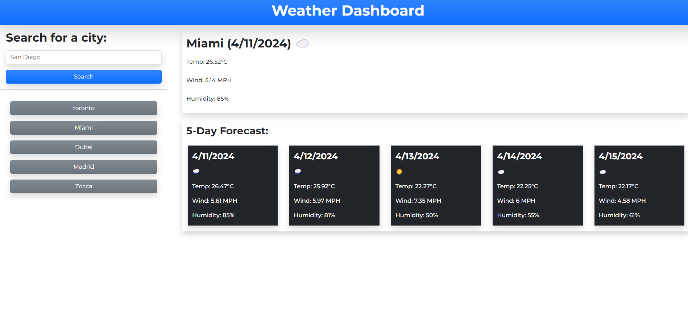

# Weather Dashboard

## Description
A weather dashboard application that shows the weather outlook for multiple cities. Use the search bar to enter a city name (i.e., Toronto, Miami, Dubai, ...) to see it's current weather conditions and date along with it's 5-day weather forecast with the corresponding dates. Once the city name is submitted, it will be added to the search history below the form. When a previous search from the history is clicked, the weather information will be displayed on the page for that search. 

## Screenshot

## URL
https://michellebell0.github.io/weather-dashboard/

## API 
OpenWeather API: https://home.openweathermap.org/

## License
This project is licensed under the [MIT License](./LICENSE).